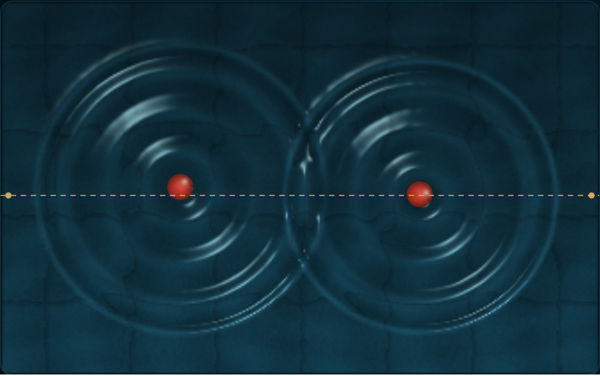
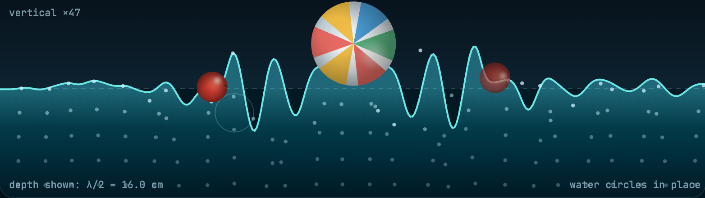
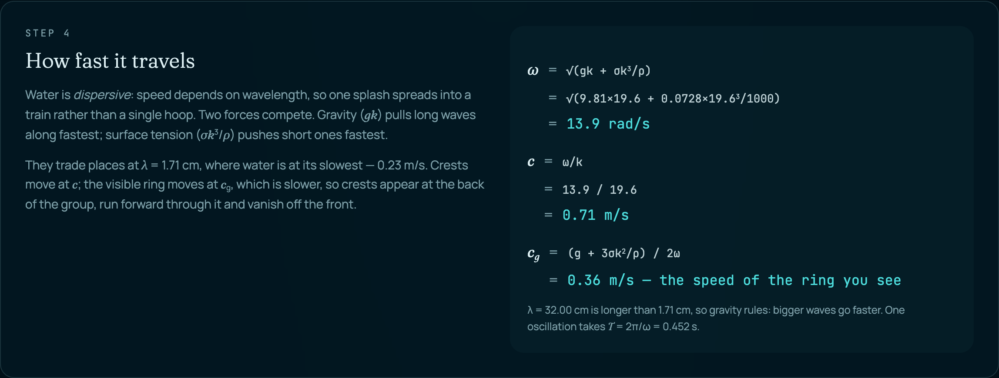
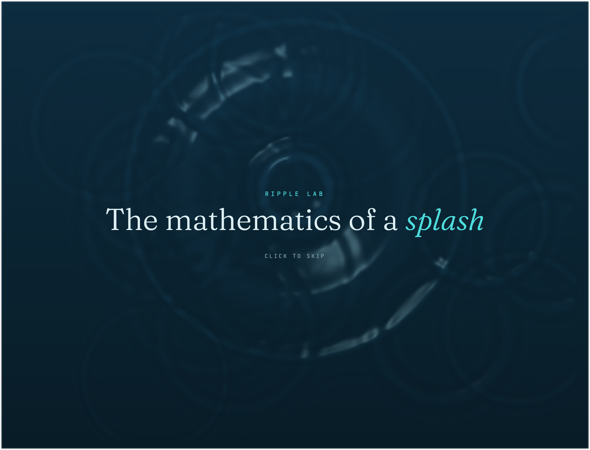

<div align="center">



# Ripple Lab

### The mathematics of a splash

Drop something into water and watch the equations that describe it —<br>
worked out, live, on the thing you just dropped.

<br>

[](https://iamdavidle.github.io/Math_in_waterwave/)

[](https://github.com/IamDavidLe/Math_in_waterwave/actions/workflows/deploy-pages.yml)


<br>

**[Overview](#overview)** · **[Quick start](#quick-start)** · **[The physics](#the-physics)** · **[The solver](#the-solver)** · **[Tests](#tests)** · **[Caveats](#where-it-bends-the-truth)**

</div>

---

## Overview

A water surface you can throw things at, and a physics walkthrough that keeps pace with it.

Size and weigh an object, choose what it is made of, drop it in. The ripples it makes are not an animation — they are integrated from a wave equation, cell by cell, sixty times a second. Everything the page tells you about wavelength, speed, crest height and decay is computed from _that_ object, and shown with the arithmetic written out, so any number on the page can be checked by hand.

### What you can do with it

| | |
| --- | --- |
| 📐 **Size and weigh it** | Drag the pad to resize against a centimetre rule, or use the sliders. Pick a material — cork through lead — and weight follows volume. |
| 🔭 **Watch it from two sides** | From above, or cut straight through the water. Drag the cut anywhere; it follows whatever you just dropped. |
| 🌀 **See water move** | In the side view, tracer dots show water circling in place as a wave passes, orbits shrinking with depth. |
| 🧪 **Change the water** | Surface tension, viscosity, the nonlinear coupling, reflecting walls, whether crests may break. |
| 👆 **Stir it** | Click to drop, drag to run a finger through the surface. |

<table>
<tr>
<td width="50%"></td>
<td width="50%"></td>
</tr>
<tr>
<td align="center"><em>Side view — water circles in place</em></td>
<td align="center"><em>Every formula, worked through</em></td>
</tr>
</table>

---

## Quick start

Requires [Bun](https://bun.sh).

```sh
git clone https://github.com/IamDavidLe/Math_in_waterwave.git
cd Math_in_waterwave/frontend
bun install
bun run dev          # → http://localhost:8080
```

| Command | What it does |
| --- | --- |
| `bun run dev` | Dev server on port 8080 |
| `bun run test` | 27 tests: physics, solver invariants, rendering maths |
| `bun run lint` | Lint the source |
| `bun run build` | Server build |

---

## The physics

Three numbers go in: mass $m$, radius $r$, drop height $h$. Everything else follows.

### 1 · The fall

Height becomes speed, and mass is absent — a feather and a cannonball arrive together. Mass decides what that speed is worth:

$$v = \sqrt{2gh} \qquad E = mgh \qquad \varepsilon \approx 0.05 \text{ of } E \text{ leaves as waves}$$

### 2 · The cavity

Two limits compete: the hole can be no narrower than the object, and no wider than the energy can pay for, since opening it means lifting water out.

$$R = \max\left(r, \tfrac{1}{2}\left(\frac{E}{\rho g}\right)^{1/4}\right)$$

### 3 · The wave

The collapsing rim sets the wavelength — one wave spans about the width of the hole that made it.

$$\lambda \approx 2R \qquad k = \frac{2\pi}{\lambda}$$

### 4 · How fast it travels

Gravity pulls long waves along fastest; surface tension pushes short ones fastest. They trade places at $\lambda \approx 1.7$ cm, where water is at its slowest — 23 cm/s. Crests move at $c$, the visible ring at $c_g$.

$$\omega^2 = gk + \frac{\sigma k^3}{\rho} \qquad c = \frac{\omega}{k} \qquad c_g = \frac{\mathrm{d}\omega}{\mathrm{d}k}$$

### 5 · How tall, how long

The wave energy spreads over the first ring; viscosity then drains it at a rate that climbs with the square of the wavenumber — so fine chop dies in moments while the long swell rolls on.

$$A = \sqrt{\frac{2\varepsilon E}{\rho g \cdot 2\pi R\lambda}} \qquad \gamma = 2\nu k^2$$

### 6 · The splash

Whether the crown tears into droplets is inertia against surface tension. Then it is a question of density — and a float sits at the depth that displaces its own weight, bobbing at a rate set by the width of its _waterline_, not of its equator.

$$We = \frac{\rho v^2 r}{\sigma} \qquad \rho_o = \frac{m}{\tfrac{4}{3}\pi r^3}$$

---

## The solver

The relations above are closed-form estimates for a single ripple. The surface on screen is integrated from one equation for the height $\eta$:

$$\eta_{tt} = \nabla\cdot\left(c^2(\eta)\nabla\eta\right) - \beta\nabla^4\eta + \nu\nabla^2\eta_t$$

Each term buys one behaviour you can see:

- **$\nabla\cdot(c^2(\eta)\nabla\eta)$, with $c^2(\eta) = c^2(1+\alpha\eta)$** — wave speed depends on the height of the water it passes through, so crests outrun troughs. This is what makes two rings interact where they meet instead of sliding through each other. It has to be written in flux form, or the field gains energy on every reflection.
- **$-\beta\nabla^4\eta$** — dispersion. Short waves are stiffened so they outrun long ones, turning each impact into a spreading train rather than a lonely hoop.
- **$\nu\nabla^2\eta_t$** — viscosity, biting as $k^2$.

On top sits one rule: real water spills when a crest is too **steep**, not too tall. A crest past the slope limit sheds its excess as foam, and a crest that suddenly loses height is itself a new disturbance — so it radiates. That is a new wave, born from an old one breaking.

The solver is a 9-point isotropic stencil (the 5-point one radiates squares), and it is strictly dissipative: breaking removes energy at both time levels, never injects it.

---

## Tests

`bun run test` covers the physics and the solver's invariants, not just that it runs:

- the dispersion relation puts its minimum at $\lambda = 1.71$ cm and 23.1 cm/s, and reduces to $\omega^2 = gk$ for long waves
- a float sits at the depth that displaces its own weight, and bobs slowly enough to animate
- the surface stays bounded for thousands of steps and loses energy over time
- the ring travels outward; a dispersive train crosses zero many times, a single hoop does not
- two colliding rings do **not** simply superpose — the nonlinear term does real work
- **breaking never adds energy**, measured one step at a time from an identical state

> That last one guards a bug that was live for a while: the shed excess was re-emitted as a ring carrying more energy than the crest lost.

---

## Project layout

```
frontend/src/
├── lib/
│   ├── water-physics.ts    closed-form relations: dispersion, cratering, buoyancy
│   ├── water-sim.ts        the solver — nonlinear, dispersive, damped, with breaking
│   └── object-looks.ts     how each material and object is drawn
├── components/
│   ├── ripple-pool.tsx     top view, side view, and the measured cross-section
│   ├── physics-guide.tsx   the walkthrough, with every formula worked through
│   ├── object-dial.tsx     drag-to-resize sizing pad
│   └── intro-splash.tsx    the landing animation
└── routes/index.tsx        the page
```

---

## Deploying

Pushing to `main` builds and publishes to GitHub Pages. The app renders on a server normally; the Pages build sets `GH_PAGES_BASE`, which switches it to prerender to static HTML and rewrite asset URLs for the repo subfolder:

```sh
GH_PAGES_BASE=/Math_in_waterwave/ bun run build   # → frontend/.output/public
```

---

## Where it bends the truth

Worth knowing, since the rest of the page is careful.

**The side view exaggerates vertically.** Crests are millimetres across a 1.6 m tank and would be invisible at 1:1, so the view scales them up — and prints the factor rather than hiding it. Depth is drawn to its own true scale.

**The solver's dispersion is the capillary branch.** $\omega^2 = c^2k^2 + \beta k^4$ gives short-waves-faster; true deep-water gravity waves are not expressible in a local height field. The numbers on the page use the exact relation; the pixels use the local approximation.

**Cratering and wave efficiency are scaling laws**, order-of-magnitude honest rather than exact.

---

<div align="center">

<br><br>
Built with <a href="https://tanstack.com/start">TanStack Start</a>, React and Tailwind.
</div>
